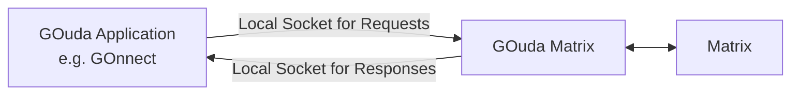

# GOuda Matrix

[](https://github.com/gonicus/gouda-matrix/actions/workflows/rust.yml)
[](LICENSE)

A Matrix client for the GONICUS [GOuda API](https://github.com/gonicus/gouda-proto).

## Architecture

GOuda Matrix acts as a bridge between a GOuda application (e.g. [GOnnect](https://github.com/gonicus/gonnect)) and
the Matrix protocol, implementing all Matrix specific operations including authentication, messaging,
room management and end-to-end encryption.

GOuda Matrix and the application communicate through two local sockets, one for
receiving requests from the application and one for sending responses and events back.
For both sockets the application acts as the server, while GOuda Matrix is the client connecting
to the local socket.



## Getting Started

### Prerequisites

- [Rust](https://www.rust-lang.org/) (latest stable)
- [Protoc](https://github.com/protocolbuffers/protobuf) (for building protobuf definitions)
- [just](https://github.com/casey/just) (optional, for running commands via the justfile)

### Building

```bash
git clone https://github.com/gonicus/gouda-matrix.git
cd gouda-matrix
cargo build
```

### Running Tests

```bash
just test
```

### Code Quality Checks

```bash
# Run all checks (clippy, fmt, tests, unused deps, typos)
just check

# Format code
just fmt
```

## Usage

GOuda Matrix connects to two local sockets managed by a GOuda application (e.g. GOnnect).
The application acts as the server listening on these sockets,
while GOuda Matrix connects as the client.

| Argument | Description |
|---|---|
| `<request_socket>` | Path to the socket for receiving requests from the application |
| `<response_socket>` | Path to the socket for sending responses and events back to the application |

| Flag | Default | Description |
|---|---|---|
| `--log-level` | `WARN` | Log level: `OFF`, `ERROR`, `WARN`, `INFO`, `DEBUG`, or `TRACE` |
| `--log-file-path` | `gouda_client.log` | Path to the log file |

### Quick Start

First, start a GOuda application that creates the local sockets. For development and testing,
[`gouda_sandbox`](https://github.com/gonicus/gouda-core-rs/tree/main/gouda_sandbox) can be used.

Once the GOuda app is started, connect GOuda Matrix to the sockets:

```bash
cargo run /tmp/gouda-request-socket /tmp/gouda-response-socket
```
